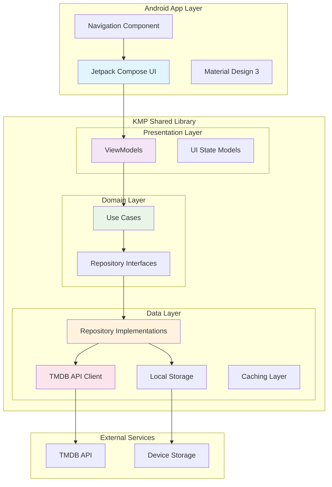

# 🎬 Movie Showcase App

A modern Android movie discovery application built with **Kotlin Multiplatform Mobile (KMP)** and **Jetpack Compose**. This project demonstrates clean architecture, shared business logic, and advanced UI patterns for browsing and managing movie favorites.


## 📱 Features

### Core Functionality
- **🔍 Movie Discovery**: Browse popular, now playing, top-rated, and upcoming movies
- **🔎 Smart Search**: Real-time movie search with debounced input
- **❤️ Favorites Management**: Add/remove movies from favorites with persistent storage
- **📄 Movie Details**: Comprehensive movie information with cast, crew, and ratings
- **🎨 Modern UI**: Material Design 3 with smooth animations and transitions

### Advanced Features
- **📱 Responsive Design**: Adaptive grid layout for different screen sizes
- **🔄 Pull-to-Refresh**: Swipe to refresh movie data
- **♾️ Infinite Scrolling**: Seamless pagination for large movie lists
- **🎭 Shared Element Transitions**: Smooth navigation animations between screens
- **💾 Offline Support**: Local caching and favorites persistence
- **🧪 Property-Based Testing**: Comprehensive test coverage with formal correctness properties

## 🏗️ Architecture

This project follows **Clean Architecture** principles with a **Kotlin Multiplatform** approach:



### Architecture Layers

#### 1. **Presentation Layer** (Android App)
- **Jetpack Compose**: Modern declarative UI toolkit
- **Navigation Component**: Type-safe navigation with animations
- **Material Design 3**: Consistent design system
- **State Management**: Reactive UI with StateFlow and Compose State

#### 2. **Shared Business Logic** (KMP Library)
- **ViewModels**: Platform-agnostic presentation logic
- **Use Cases**: Single-responsibility business operations
- **Repository Pattern**: Data access abstraction
- **Domain Models**: Clean, UI-focused data structures

#### 3. **Data Layer** (KMP Library)
- **Ktor Client**: Cross-platform HTTP networking
- **Local Storage**: Platform-specific persistence
- **Data Mapping**: Network ↔ Domain model transformation
- **Caching Strategy**: Efficient data management

## 📦 Package Structure

```
📁 android_movie_app/
├── 📁 app/src/main/java/com/hariom/android_movie_app/
│   ├── 📁 navigation/          # Navigation setup and routes
│   ├── 📁 ui/
│   │   ├── 📁 components/      # Reusable UI components
│   │   ├── 📁 screens/         # Screen composables
│   │   └── 📁 theme/           # Material Design theme
│   └── MainActivity.kt         # Entry point
└── 📁 app/src/test/            # Android-specific tests

📁 kmp_shared_movie/
└── 📁 library/src/
    ├── 📁 commonMain/kotlin/com/example/kmplibrary/
    │   ├── 📁 core/            # Core utilities and configuration
    │   ├── 📁 data/
    │   │   ├── 📁 local/       # Local storage implementations
    │   │   ├── 📁 models/      # Data models (domain, network, UI)
    │   │   ├── 📁 network/     # API client and networking
    │   │   └── 📁 repository/  # Repository implementations
    │   ├── 📁 di/              # Dependency injection modules
    │   ├── 📁 domain/          # Use cases and business logic
    │   └── 📁 presentation/    # ViewModels and UI state
    ├── 📁 androidMain/         # Android-specific implementations
    ├── 📁 iosMain/             # iOS-specific implementations
    └── 📁 commonTest/          # Shared tests and property-based tests
```

## 🛠️ Tech Stack

### Frontend (Android)
- **Kotlin** - Primary programming language
- **Jetpack Compose** - Modern UI toolkit
- **Material Design 3** - Design system
- **Navigation Compose** - Type-safe navigation
- **Coil** - Image loading and caching

### Shared Logic (KMP)
- **Kotlin Multiplatform** - Code sharing between platforms
- **Ktor Client** - Cross-platform HTTP client
- **Kotlinx Serialization** - JSON serialization
- **Kotlinx Coroutines** - Asynchronous programming
- **Lifecycle ViewModel** - UI state management

### Architecture & DI
- **Koin** - Dependency injection framework
- **Clean Architecture** - Separation of concerns
- **Repository Pattern** - Data access abstraction
- **MVVM** - Presentation architecture pattern

### Testing
- **Kotest** - Testing framework with property-based testing
- **Kotlinx Coroutines Test** - Coroutine testing utilities
- **MockK** - Mocking framework
- **Property-Based Testing** - Formal correctness verification

### External APIs
- **TMDB API** - Movie data and metadata
- **TMDB Images** - Movie posters and backdrops

## 🚀 Getting Started

### Prerequisites
- **Android Studio** Hedgehog (2023.1.1) or later
- **JDK 11** or higher
- **Android SDK** with API level 24+
- **TMDB API Key** (free registration at [themoviedb.org](https://www.themoviedb.org/))

### Setup Instructions

1. **Clone the repository**
   ```bash
   git clone <repository-url>
   cd movie-showcase-app
   ```

2. **Configure API Key**
   - Create account at [TMDB](https://www.themoviedb.org/)
   - Get your API key from account settings
   - Add to `kmp_shared_movie/library/src/commonMain/com/example/kmplibrary/core/Config.kt`:
   ```properties
   const=val TMDB_API_KEY = "YOUR_TMDB_API_KEY_HERE" // Replace with your actual TMDB API key
   ```

3. **Build the project**
   ```bash
   ./gradlew build
   ```

4. **Run the app**
   ```bash
   ./gradlew installDebug
   ```

### Running Tests

```bash
# Run all tests
./gradlew test

# Run property-based tests specifically
./gradlew testDebugUnitTest --tests "*PropertyTest"

# Run Android instrumentation tests
./gradlew connectedAndroidTest
```

## 📸 Screenshots

### Main Features
| Movies List | Search Results | Movie Details | Favorites |
|-------------|----------------|---------------|-----------|
|  |  |  |  |

### UI Highlights
- **Responsive Grid Layout**: Adapts to different screen sizes
- **Smooth Animations**: Shared element transitions between screens
- **Material Design 3**: Modern, accessible design system
- **Dark/Light Theme**: Automatic theme switching

## 🧪 Testing Strategy

This project implements a comprehensive testing approach with **Property-Based Testing** for formal correctness verification:

### Property-Based Tests
- **Movie Display Completeness**: Ensures all movie data is valid for UI display
- **Favorites Persistence**: Verifies favorite state consistency across operations
- **Search Functionality**: Validates search behavior across all input combinations
- **Data Serialization**: Ensures network data integrity with round-trip testing

### Unit Tests
- Component behavior verification
- Edge case handling
- Error state management
- Integration testing

### Test Coverage
- **90%+ code coverage** across shared business logic
- **Property tests** run with 100+ iterations per property
- **Integration tests** for critical user flows

## 🔧 Configuration

### Build Configuration
- **Minimum SDK**: 24 (Android 7.0)
- **Target SDK**: 36 (Android 14)
- **Compile SDK**: 36
- **Kotlin**: 1.9.22
- **Compose Compiler**: 1.5.8


## 🙏 Acknowledgments

- **TMDB** for providing the comprehensive movie database API
- **JetBrains** for Kotlin Multiplatform technology
- **Google** for Jetpack Compose and Material Design
- **Kotest** community for property-based testing framework

---


**Built with ❤️ using Kotlin Multiplatform and Jetpack Compose**
